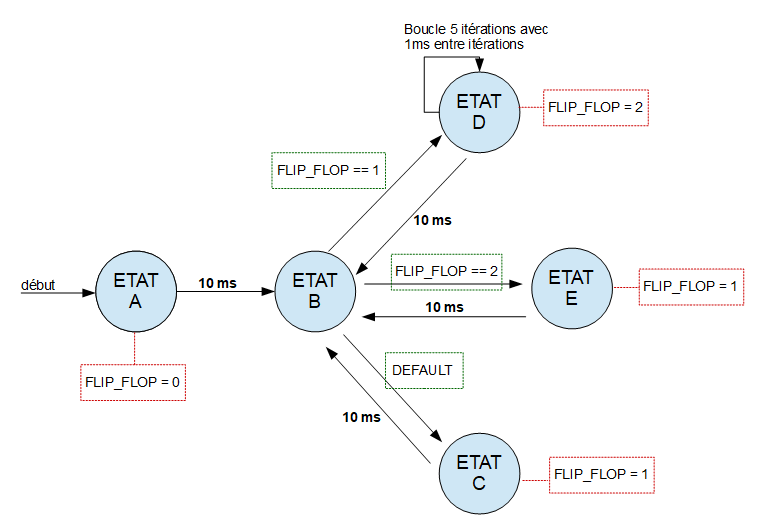

# ModelGenerator  [](./LICENSE.md)

This repository contains the sources of a small c++11 static library called **ModelGenerator** that allows you to _build finite-state machines from an xml input file_.

# Organisation

This repository has the following organisation :
 - **_src_** The source code of the Library
 - **_tests_** The unit tests that come with it.
 - **_include_** Which provides a high-level interface to the library.
 - **_data_** A folder with samples of data you should input to the program (see **Logs** and **Configuration** sections).
 - **_install_ModelGenerator_** \[**OUTPUT**\] The folder that contains the inclusion header for the static library, the static library itself and the executables built when compiling with the provided _CMakeList_.

 Note that these tests are using [**Catch2**](https://github.com/catchorg/Catch2) library, which is a header-only c++ framework for unit testing.


# How does it work ?

## Logs

If you want to see the results of the run in a file, you can provide it with the **-l** argument.

Note : The **-t** argument will control the verbosity of the log messages.

We will call that file a **Log file**. ( a default empty one is provided [**here**](./data/Logs/default-log) )


## Configuration

You have to provide a specific **Configuration file** (_xml input file_) that **describes the finite-state automaton** you desire.

You can provide it with the mandatory **-c** argument.

For example, the sample Conf [**here**](./data/Conf/conf-test.xml) describes the following finite-state automaton :



Basically, this automaton will do the following :
TIME (ms) | STATE | FLIP_FLOP (variable)
--------- | ----- | ---------
0 | STATE_A | 0 
10 | STATE_B | 0
10 | STATE_C | 1
20 | STATE_B | 1
20 | STATE_D | 2
21 | STATE_D | 2
22 | STATE_D | 2
23 | STATE_D | 2
24 | STATE_D | 2
34 | STATE_B | 2
34 | STATE_E | 1
44 | STATE_B | 1
44 | STATE_D | 1
...

The **Configuration file** defines :
 - **Params** : Containing a list of parameters used by the model.
 
The states (and your code of course) can apply operations to those variables.
 - **States** : Containing a list of states caracterized by
   - Their **ID** (name).
   - The arithmetical **operations** made on _model variables_ when entering this state.
   - The **transitions** toward other states.
     - A transition always has a _dest-state_ (specified with its name)
     - It can be a **condition** on a _model variable_
     - It can also be a **delay** condition (the delay value is expressed in **us**) - meaning this will be triggered after x us in that state.
     - A transition can also be a **loop** that transits to the same state a required amount of times.

# Run the sample test

After compiling the library - using the provided _CMakeLists_ - you can run the **ModelGeneratorSample.exe** in _install_ModelGenerator/bin_ with the following options :
 - **-c** < Complete path to _install_ModelGenerator/data/Conf/conf_test.xml_ >
 - **-l** < Complete path to _install_ModelGenerator/data/Logs/default-logs_ >
 - **-t 2**

Note that the option **-h** will give you the list of possible options.

As a result, your _Log file_ will be filled by the program.

This is the content of _default-logs_ file after I killed the program :

```
14h:18m:20s:431ms:: Log file set to C:\Users\Luc-Henri\Desktop\Logs\default-logs
14h:18m:20s:431ms:: Configuration file set to C:\Users\Luc-Henri\Desktop\Conf\conf_test.xml
14h:18m:20s:431ms:: Added a new State (STATE_A) to the model.
14h:18m:20s:431ms:: Added a new State (STATE_B) to the model.
14h:18m:20s:431ms:: Added a new State (STATE_C) to the model.
14h:18m:20s:431ms:: Added a new State (STATE_D) to the model.
14h:18m:20s:431ms:: Added a new State (STATE_E) to the model.
14h:18m:20s:431ms:: Model Integrity successfully checked.
14h:18m:20s:431ms:: Configuration file parsed successfully.
14h:18m:20s:431ms:: 
        ------ VARIABLES ------
 FLIP_FLOP 0
        ------ MESSAGES ------

        ------ HEADERS ------

        ------ STATES ------
State STATE_A
    Operations:
        FLIP_FLOP =   (Asignement) 0
    Transitions:
        DelayCond -> STATE_B (delay 10000 us)
State STATE_B
    Transitions:
        VarCond   -> STATE_D (test FLIP_FLOP == (equal) 1)
        VarCond   -> STATE_E (test FLIP_FLOP == (equal) 2)
        VarCond   -> STATE_C (test FLIP_FLOP == (equal) 1)
State STATE_C
    Operations:
        FLIP_FLOP =   (Asignement) 1
    Transitions:
        DelayCond -> STATE_B (delay 10000 us)
State STATE_D
    Operations:
        FLIP_FLOP =   (Asignement) 2
    Transitions:
        Loop      -> STATE_D 5 times (delay 1000 us)
        DelayCond -> STATE_B (delay 10000 us)
State STATE_E
    Operations:
        FLIP_FLOP =   (Asignement) 1
    Transitions:
        DelayCond -> STATE_B (delay 10000 us)

14h:18m:20s:431ms:: STATE_A
14h:18m:20s:441ms:: STATE_B
14h:18m:20s:441ms:: STATE_C
14h:18m:20s:451ms:: STATE_B
14h:18m:20s:451ms:: STATE_D
14h:18m:20s:452ms:: STATE_D
14h:18m:20s:453ms:: STATE_D
14h:18m:20s:454ms:: STATE_D
14h:18m:20s:455ms:: STATE_D
14h:18m:20s:465ms:: STATE_B
14h:18m:20s:465ms:: STATE_E
14h:18m:20s:475ms:: STATE_B
14h:18m:20s:475ms:: STATE_D
14h:18m:20s:476ms:: STATE_D
14h:18m:20s:477ms:: STATE_D
14h:18m:20s:478ms:: STATE_D
14h:18m:20s:479ms:: STATE_D
14h:18m:20s:489ms:: STATE_B
14h:18m:20s:489ms:: STATE_E
14h:18m:20s:499ms:: STATE_B
14h:18m:20s:499ms:: STATE_D
14h:18m:20s:500ms:: STATE_D
14h:18m:20s:500ms:: Prgramm ended by the user (signal - 2)
```

As you can see, it clearly implements the required finite-state machine behaviour !

# How to use it ?

This is pretty simple !

After the built, you will have the following files into the **_install_ModelGenerator_** folder :
    - lib/**libModelGenerator.a**
    - include/**modelGenerator_interface.h**

All you need to do is to :
    - include the header file using the _include_directories_ CMake command.
    - link to the static lib using the _link_directories_ CMake command.

And you are good to go ! :)
